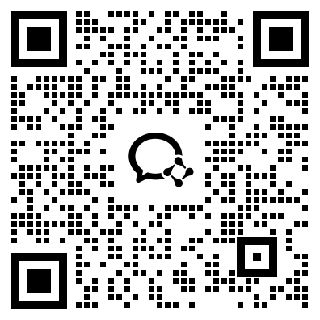

# 汇付支付 Skill 产品包

这是一个面向第三方客户的 Huifu 接入 Skill 包，用来帮助开发者借助 AI 工具完成汇付支付 / 斗拱 SDK 接入开发。

README 按 **产品线 -> 开发任务 -> 技术栈** 导航，先帮你定位入口，再进入对应文档。当前仓库已收敛为单 Skill：

- 正式 Skill：`huifu-pay-integration`
- 服务端技术栈：Java、PHP；C#、Python、Go 保留入口说明
- 前端支付组件：Node.js / Browser
- 产品能力主线：聚合支付、托管支付、前端支付组件

选择建议：优先使用聚合支付，接入更快、更轻量；当你需要托管收银台、项目制预下单或前端 checkout 能力时，再进入托管支付和前端支付组件路径。

## 如何开始

下文中的 `references/...` 均指 `huifu-pay-integration/references/...`。

### 1. 先按产品线定位

| 产品线 | 适合什么场景 | 从这里开始 |
| --- | --- | --- |
| 汇付支付集成（总入口） | 第一次接入汇付，需要先判断产品线、开发任务和阅读顺序 | `huifu-pay-integration/SKILL.md` |
| 聚合支付 | 标准支付场景，想尽快完成服务端接入 | `references/aggregation-quickstart.md` |
| 托管支付（服务端） | 需要项目制预下单、托管收银台、查询 / 退款闭环 | `references/hostingpay-quickstart.md` |
| 前端支付组件 | 需要在商户自有页面嵌入 checkout 或单支付按钮 | `references/checkout-js.md` |

### 2. 再按开发任务进入

| 开发任务 | 聚合支付 | 托管支付 / 前端支付组件 |
| --- | --- | --- |
| 初始化 / 公共配置 | `references/aggregation-base.md` | `references/hostingpay-base.md` |
| 下单 / 预下单 | `references/aggregation-order.md` | `references/hostingpay-preorder.md` |
| 查询 / 关单 / 对账 | `references/aggregation-query.md` | `references/hostingpay-query.md` |
| 退款 | `references/aggregation-refund.md` | `references/hostingpay-refund.md` |
| 收银台组件接入 / 单支付按钮 | 不适用 | `references/checkout-js.md` |

### 3. 最后按技术栈落地

| 技术栈 | 推荐入口 | 说明 |
| --- | --- | --- |
| Java | `references/shared-server-sdk-matrix.md` | 聚合支付和托管支付都有稳定基线 |
| PHP | `references/shared-server-sdk-matrix.md` | 聚合支付核心主链路和托管支付核心场景已覆盖 |
| C# / Python / Go | `references/shared-server-sdk-matrix.md` | 当前只保留入口说明 |
| Node.js / Browser | `references/shared-frontend-sdk-matrix.md` | 前端 JS SDK 能力矩阵 |
| Node.js / Browser | `references/checkout-js.md` | 嵌入 checkout / 单支付按钮的实际入口 |

## 产品线说明

### 聚合支付

聚合支付是一条服务端主线，适合标准支付接入和快速上线。

推荐阅读顺序：

```text
references/aggregation-quickstart.md
  -> references/aggregation-base.md
  -> references/aggregation-order.md
  -> references/aggregation-query.md
  -> references/aggregation-refund.md（按需）
```

### 托管支付

托管支付的服务端主线负责 SDK 初始化、预下单、查询、关单、对账和退款。

推荐阅读顺序：

```text
references/hostingpay-quickstart.md
  -> references/hostingpay-base.md
  -> references/hostingpay-preorder.md
  -> references/hostingpay-query.md
  -> references/hostingpay-refund.md（按需）
```

### 前端支付组件

前端支付组件用于在商户自定义页面中嵌入 checkout 组件或单支付按钮，让商户自己控制页面布局、品牌样式和交互流程。

必须注意：前端 callback 不等于最终支付成功，最终订单状态仍应由服务端查询或异步通知确认。

推荐主链路：

```text
服务端预下单：references/hostingpay-preorder.md
  -> 前端渲染 checkout / 按钮：references/checkout-js.md
  -> 服务端最终确认：references/hostingpay-query.md + references/hostingpay-async-webhook.md
```

## 共享资料层

这些共享资料不再分散在多个 Skill 中重复维护：

| 资料 | 作用 |
| --- | --- |
| `references/shared-signing-v2.md` | V2 签名规则 |
| `references/shared-async-notify.md` | 接口 `notify_url` 异步通知规则 |
| `references/shared-webhook-signing.md` | 控台 Webhook 终端密钥与 MD5 验签规则 |
| `references/shared-request-header-policy.md` | 请求头与 skill 来源字段规则 |
| `references/shared-server-sdk-matrix.md` | 服务端多语言矩阵 |
| `references/shared-frontend-sdk-matrix.md` | 前端 JS SDK 矩阵 |
| `references/shared-versioning-policy.md` | 版本治理规则 |
| `references/shared-release-checklist.md` | 发布检查清单 |

## Skill 内部结构

```text
huifu-pay-integration/
├── SKILL.md
├── agents/
│   └── openai.yaml
└── references/
    ├── shared-*.md
    ├── aggregation-*.md
    ├── hostingpay-*.md
    └── checkout-js-*.md
```

## 当前版本事实

| 项目 | 当前口径 |
| --- | --- |
| Skill 包版本 | `1.2.0` |
| 托管支付 Java SDK 常量版本 | `dg-java-sdk 3.0.36` |
| 聚合支付 Java SDK 版本 | `dg-lightning-sdk 1.0.5` |
| PHP SDK 包 | `huifurepo/dg-php-sdk 2.0.26` |
| 前端收银台 JS SDK | `@dg-elements/js-sdk`，接入时以项目锁定版本为准 |

## 文档说明

- 优先阅读 `huifu-pay-integration/SKILL.md` 与 `references/` 下的场景文档
- 服务端接入优先从 `references/shared-server-sdk-matrix.md` 和对应 `*-base.md` 开始
- 前端接入优先从 `references/shared-frontend-sdk-matrix.md` 和 `references/checkout-js.md` 开始
- AI 生成接入代码时，不应自行猜测商户参数、项目配置或最终支付状态
- `HUIFU_RSA_PRIVATE_KEY`、`HUIFU_RSA_PUBLIC_KEY` 等敏感配置只能留在服务端

## 官方技术支持

如需官方技术支持或接入答疑，可通过以下官方渠道联系：

- 客服电话：400-820-2819
- 官方邮箱：cs@huifu.com

企业微信技术支持群（仅用于接入答疑 / 技术支持）：


