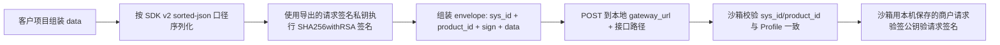
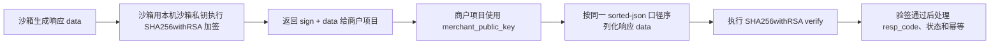

# hf-payment-local-sandbox 使用说明

适用版本：`hf-payment-local-sandbox` 1.0.1（源码/提测候选；当前公开 preview 仍为 1.0.0）

适配 Skill 使用说明：`huifu-pay-integration` 1.3.2

冻结协议来源 Skill：`huifu-pay-integration` 1.3.1

适配合同包：`huifu-pay-integration-1.3.0-r4`

## 重要边界

本地沙箱服务只用于本地协议模拟、场景演练、SDK sample 检查和报告生成。它不是官方联调环境，不代表官方联调通过，也不代表生产环境可以直接上线。

预览版未进行正式代码签名和 macOS 公证。首次运行时，如果系统提示安全确认，请按本公司内部软件分发流程处理。

## 解压后文件

平台 archive 中通常包含：

- `hf-payment-local-sandbox` 或 `hf-payment-local-sandbox.exe`
- `start-local-sandbox.cmd`：Windows 双击启动器
- `start-local-sandbox.command`：macOS 双击启动器
- `start-local-sandbox.sh`：Linux / macOS 终端启动器
- `README.txt`
- `USAGE.md`
- `build-info.json`
- `LICENSE`
- `THIRD_PARTY_NOTICES.txt`

外层 preview zip 还包含 `dist/SHA256SUMS.txt`、各平台 archive、SBOM、provenance、release manifest 和 readiness report。

## 快速检查

Linux / macOS：

```bash
chmod +x ./hf-payment-local-sandbox
./hf-payment-local-sandbox version --json
./hf-payment-local-sandbox doctor --json
./hf-payment-local-sandbox validate contract
```

Windows PowerShell：

```powershell
.\hf-payment-local-sandbox.exe version --json
.\hf-payment-local-sandbox.exe doctor --json
.\hf-payment-local-sandbox.exe validate contract
```

`doctor` 和 `validate contract` 都通过后，再启动服务。

## 普通用户双击启动

预览包解压后，普通用户优先使用启动器，不需要手写命令：

- Windows：双击 `start-local-sandbox.cmd`
- macOS：双击 `start-local-sandbox.command`
- Linux：在终端运行 `./start-local-sandbox.sh`

启动器会使用 `official-demo` Profile，默认启动：

- 控制台：`http://127.0.0.1:8765/`
- 本地网关：`http://127.0.0.1:8766`
- 数据目录：解压目录下的 `sandbox-data`
- 报告目录：解压目录下的 `sandbox-report`

启动后会自动打开浏览器控制台，并在启动窗口打印 `Admin token`。测试期间不要关闭启动窗口；需要在页面生成报告或停止服务时，输入这个 token。如果浏览器没有自动打开，手动访问 `http://127.0.0.1:8765/`。

## 启动服务

Linux / macOS：

```bash
./hf-payment-local-sandbox serve \
  --control-port 8765 \
  --gateway-port 8766 \
  --credential-profile official-demo \
  --data-dir ./sandbox-data \
  --report-dir ./sandbox-report \
  --print-json
```

Windows PowerShell：

```powershell
.\hf-payment-local-sandbox.exe serve `
  --control-port 8765 `
  --gateway-port 8766 `
  --credential-profile official-demo `
  --data-dir .\sandbox-data `
  --report-dir .\sandbox-report `
  --print-json
```

启动成功后，标准输出会打印 `ready` JSON，其中包括：

- `control_url`：控制面接口地址，默认在 `127.0.0.1:8765`
- `gateway_url`：支付网关模拟地址，默认在 `127.0.0.1:8766`
- `health_url`：健康检查地址
- `data_dir`：本地数据目录
- `report_dir`：本轮报告目录
- `mode`：默认 `local-simulation`
- `credential_profile`：默认示例建议使用 `official-demo`
- `signature_model`：本地沙箱加验签模型，默认 `dual_key_local_sandbox`
- `admin_token`：控制面管理令牌
- `csrf_token`：控制面写操作校验令牌，仅 `--print-json` 启动输出返回
- `webhook_endpoint_key`：本地 Webhook 验签用端点密钥，仅 `--print-json` 启动输出返回
- `update_index_url`：公开版本索引地址，默认 `https://cloudpnrcdn.oss-cn-shanghai.aliyuncs.com/huifuskills/hf-payment-local-sandbox-latest.json`

停止服务时使用 `Ctrl+C`。正常退出时会写入报告目录。

## 交互控制台

启动后，在浏览器打开 `control_url`，例如：

```text
http://127.0.0.1:8765/
```

控制台会自动刷新本轮沙箱状态：

- 首次进入页面：展示本地沙箱服务使用声明；默认勾选“不再提示”，同意后继续使用，拒绝后停止本地沙箱服务并尝试关闭当前页面
- 接入信息：版本、运行模式、Profile、签名模型、合同包和指纹
- 项目接入配置：当前 `gateway_url`、凭证导出、配置复制和使用说明
- 顶部指标卡：支付、退款、关单的主数字为总数，下方只展示成功、处理中和失败；对账、请求日志、事件和安全发现展示总数
- 业务状态：以标签页查看支付、退款、关单、对账任务，并在可触发记录上发送测试 Notify 或 Webhook
- 托管支付：支付记录中可点击“模拟成功”，用于模拟用户完成托管收银台支付；项目再次查单会得到成功状态
- 请求日志：点击“详情”查看入参、响应参数、信封和签名摘要；摘要只展示 `sign_sha256` 和长度，不展示原始 `sign`。如果显示 `invalid_envelope`、`sign_status=missing` 或 `missing_fields`，通常表示客户项目没有按 `sys_id/product_id/sign/data` envelope 发送请求
- 事件流：最新请求、状态流转、故障注入和场景事件
- 通知与安全：Notify、Webhook 投递记录和安全拦截
- 版本更新：读取公开 JSON 索引，提示是否有新版，并提供当前平台下载地址和 SHA256

点击“导出凭证”、“复制配置”、“生成报告”、“停止”、请求日志“详情”或手动触发 Notify/Webhook 时，需要输入启动输出中的 `admin_token`。检查更新不需要 token，只会请求公开版本索引，不上传私钥、公钥、`sys_id`、`product_id`、`huifu_id`、请求日志、报告、Webhook 地址或 Notify 地址。页面不会持久化保存 token；状态接口不会返回 `admin_token`、`csrf_token`、完整私钥、Webhook 端点密钥或回调 URL query 明文；回调目标会按 `REDACTED` 展示。

常用按钮：

- “导出凭证”：下载 `sandbox-credentials.json`，用于把 `sys_id`、`product_id`、请求签名私钥和验签公钥配置到客户项目
- “复制配置”：复制带 `merchant_private_key` 和 `merchant_public_key` 的项目接入配置，方便粘贴到本机配置模板；不要粘贴到工单、聊天窗口或公开文档
- “显示 Webhook Key”：输入 `admin_token` 后显示 `webhook_endpoint_key`，用于客户项目验证本地沙箱 Webhook 签名；业务侧计算大写 `MD5(raw_body + webhook_endpoint_key)` 并与 URL query 中的 `sign` 比较
- “保存 Webhook”：在页面输入本机 Webhook 接收地址后保存，本次运行内业务状态里的 Webhook 成功/失败按钮会变为可用
- “检查更新”：读取 `hf-payment-local-sandbox-latest.json`，如有新版则展示下载按钮、文件名、大小和 SHA256；沙箱不会自动替换正在运行的程序
- “使用说明”：打开页面内接入步骤、请求签名流程和响应验签流程
- “支持”：显示技术支持入口
- “回到顶部”：页面右下角浮动按钮，长页面滚动后可快速回到顶部

业务状态统计口径：

- 支付：`P` 表示处理中，`S` 表示成功，`F` 表示失败或已被关单影响
- 退款：业务记录主要出现 `P` 和 `S`；超额等失败通常直接返回失败响应，不一定形成退款业务记录
- 关单：业务记录主要出现 `P` 和 `S`；关单成功后，原支付可能进入 `F` 状态

手动触发 Notify/Webhook：

- 手动触发 Notify/Webhook 只发送测试投递 payload 并记录投递结果，不修改支付、退款、关单主记录；“模拟成功”会修改托管支付主记录
- 支付、退款和关单记录支持 Notify 成功/失败；支付、退款和关单记录支持 Webhook 成功/失败；关单 Notify 使用原下单交易保存的 `notify_url`
- Notify 是交易接口 `notify_url` 回调，使用 `application/x-www-form-urlencoded;charset=UTF-8` 表单提交 `sign` 和 `resp_data`；接收端应从表单参数读取 `resp_data/sign`，不要用只接收 JSON body 的 Controller
- Notify 接收方必须返回 `RECV_ORD_ID_<req_seq_id>` 才算投递成功
- Webhook 是平台事件通知，使用 `application/json` 原始请求体，`sign` 放在 URL query；沙箱按官方口径发送大写 MD5，Webhook 不使用 `RECV_ORD_ID_` 回包
- Webhook 接收方返回任意 HTTP 2xx 才算投递成功；3xx 重定向会被拦截并记录安全发现
- 如果业务记录没有 `notify_url`，Notify 成功/失败按钮会禁用；退款未单独传 `notify_url` 时会继承原交易 `notify_url`，关单会使用原下单交易 `notify_url`。如果未配置 Webhook 目标，Webhook 成功/失败按钮会禁用。可以启动时传 `--webhook-target`，也可以在页面“Webhook 目标地址”输入本机接收地址并保存。后端仍会再次校验触发条件，避免页面状态过期导致误投递

## 检查更新

控制台会从公开 JSON 索引检查最新版本：

```text
https://cloudpnrcdn.oss-cn-shanghai.aliyuncs.com/huifuskills/hf-payment-local-sandbox-latest.json
```

首次打开页面时会自动检查一次，也可以在“接入信息”区域点击“检查更新”。如果发现新版，页面会展示当前平台下载按钮、文件名、大小和 SHA256。沙箱不会静默下载、安装或替换正在运行的程序；用户下载新版后，需要按预览包说明手动解压并重新启动。

维护者生成公开 JSON 索引：

```bash
python3 scripts/generate_local_sandbox_update_index.py \
  --manifest release-preview/1.0.1/dist/release-manifest.json \
  --public-base-url https://cloudpnrcdn.oss-cn-shanghai.aliyuncs.com/huifuskills/ \
  --output release-preview/1.0.1/hf-payment-local-sandbox-latest.json
```

上传时保持文件名：

```text
hf-payment-local-sandbox-latest.json
```

并和各平台 archive 放在同一公开目录下：

```text
https://cloudpnrcdn.oss-cn-shanghai.aliyuncs.com/huifuskills/
```

## 凭证

推荐使用 `official-demo` Profile。它把用户可见配置收敛为一套本地沙箱加验签凭证：

- `product_id`
- `sys_id`
- 商户请求签名私钥，本机读取或首次启动生成，不会内置到预览包
- 沙箱响应验签公钥，以 `merchant_public_key` 字段导出给商户项目

预览包不会内置、日志输出或报告回显完整私钥。首次使用 `official-demo` 时，如果 `sandbox-data/credentials/official-demo-merchant-private.pem` 或 `sandbox-data/credentials/official-demo-sandbox-private.pem` 不存在，沙箱会在本机生成两套 RSA 密钥：商户私钥用于客户项目请求签名，沙箱私钥用于本地沙箱响应和通知加签。文件只应保存在本机受控目录，不要提交到 Git、工单、聊天窗口或公开文档。

页面导出凭证：

1. 打开控制台 `control_url`，默认是 `http://127.0.0.1:8765/`。
2. 在页面右上方输入启动窗口打印的 `Admin token`。
3. 在“项目接入配置”区域点击“导出凭证”。
4. 浏览器会下载 `sandbox-credentials.json`。这个文件包含私钥材料，只能保存在本机受控目录，不要提交到 Git、工单、聊天窗口或公开文档。

导出的 JSON 与页面“复制配置”使用同一套扁平 key，不再包含重复的 `merchant_config`、`sandbox_config` 或说明型嵌套层。字段包括：

- `gateway_url`：配置到客户项目的 SDK 网关地址、base URL、endpoint 或支付出口层
- `sys_id`、`product_id`：配置到客户项目的汇付系统号和产品号
- `huifu_id`：本地样例汇付 ID，默认 `6666000100000001`；接真实联调或生产时改为客户自己的汇付 ID
- `skill_source`：本地沙箱模式的来源字段，当前固定为 `hfps/1.3.1;sandbox/1.0.1`；官方联调或生产使用 `hfps/1.3.2`
- `merchant_private_key`：客户项目用于请求签名的 PKCS8 Base64 私钥，无 PEM 头尾，无换行，优先配置到官方 SDK
- `merchant_public_key`：客户项目用于验证沙箱响应和通知签名的 X509 Base64 公钥，无 PEM 头尾，无换行，优先配置到官方 SDK
- `webhook_endpoint_key`：客户项目用于验证本地沙箱 Webhook 签名的 32 位终端密钥；Webhook 验签规则是大写 `MD5(raw_body + webhook_endpoint_key)`，不要和 RSA 公私钥混用
- `signature_model`：`dual_key_local_sandbox`
- `usage`：字段用途说明

`merchant_private_key` 和 `merchant_public_key` 是商户项目需要配置的两项 RSA 值：前者用于请求加签，后者用于响应和 Notify 验签，不表示同一对 RSA 密钥。`webhook_endpoint_key` 只用于 Webhook 的 MD5 验签，不是 RSA 私钥或公钥。`skill_source` 用于 SDK 来源请求头；只有本地沙箱模式使用 `hfps/1.3.1;sandbox/1.0.1`，官方联调和生产使用 `hfps/1.3.2` 且不要携带沙箱后缀。

查看 Profile 指纹，不会回显完整私钥：

```bash
./hf-payment-local-sandbox credentials show-profile official-demo
```

本地沙箱模式下，请求签名使用导出的商户私钥；沙箱用本机保存的商户请求验签公钥验请求签名；响应和通知由本机沙箱私钥加签；客户项目优先用导出的 `merchant_public_key` 验响应和通知签名。报告会标记 `signature_model = dual_key_local_sandbox`。

本地沙箱只导出这一套加验签凭证。正式联调或生产环境的真实汇付公钥和证书材料，应按官方联调/生产配置流程单独配置，不和本地沙箱导出的凭证混用。

未指定 `--credential-profile` 时，沙箱仍可生成本地 synthetic RSA 凭证，主要用于维护者回归测试。

查看指纹：

```bash
./hf-payment-local-sandbox credentials show --credential-profile official-demo --data-dir ./sandbox-data
```

普通用户优先使用页面“导出凭证”。维护者排障时也可以使用 CLI 导出，但导出的文件同样包含私钥材料，不能进入仓库、报告或公开文档。

需要重新生成本地凭证时：

```bash
./hf-payment-local-sandbox credentials rotate --data-dir ./sandbox-data
```

`rotate` 只适用于 synthetic 本地凭证，不会修改 `official-demo` Profile。需要更换 `official-demo` 密钥时，停止服务后替换或删除 `sandbox-data/credentials/official-demo-merchant-private.pem` 和 `sandbox-data/credentials/official-demo-sandbox-private.pem`。

## 已有项目接入本地沙箱

如果项目已经接入官方 SDK，不需要把业务代码改成另一套“沙箱 SDK”。推荐做法是在项目现有支付出口层增加一个仅本地启用的运行模式。

先双击启动沙箱或使用本地启动器启动服务，再在页面“项目接入配置”区域复制 `gateway_url` 并导出 `sandbox-credentials.json`。

然后在项目配置中切换这些值：

- 将网关地址改为 `gateway_url`，默认是 `http://127.0.0.1:8766`
- 使用 `official-demo` Profile 导出的同一套 `product_id/sys_id` 和请求签名私钥字段；官方 SDK 优先使用 `merchant_private_key`
- 响应和通知验签优先使用导出的 `merchant_public_key`
- 请求头建议带上 `jpt-x-skill-source: hfps/1.3.1;sandbox/1.0.1`
- 如请求中有 `huifu_id`，请求头建议带上 `jpt-x-skill-huifu_id`
- `notify_url` 优先使用本机 loopback 地址
- `notify_url` 或 Webhook 目标需要访问外部地址时，启动服务时必须显式传入 `--notify-allow <完整通知或 Webhook 地址>`
- Webhook 转发目标使用 `--webhook-target <完整本地地址>` 配置；外部 Webhook 目标同样需要 `--notify-allow`

访问地址取决于项目运行位置：

- 项目和沙箱在同一台宿主机进程中运行：使用 `http://127.0.0.1:8766`
- 项目在 Docker 容器中运行：容器内的 `127.0.0.1` 是容器自身，通常要改用宿主机地址，例如 Docker Desktop 的 `http://host.docker.internal:8766`
- 项目在另一台机器或局域网容器中运行：需要显式把沙箱网关监听到可访问地址，例如 `--gateway-host 0.0.0.0 --unsafe-expose-gateway`；这只建议在受控内网临时调试时使用，调试结束后立即关闭

如果当前 SDK 暴露了网关地址、base URL、endpoint 或 HTTP client 配置项，直接把它配置为 `gateway_url`，项目原有的 SDK request、签名和响应解析链路可以继续使用。

浏览器前端直接跨 Origin 调用本地沙箱可能被本地安全策略拦截；推荐由后端 SDK、支付出口层或本地开发代理访问 `gateway_url`。

如果当前 SDK 没有暴露网关地址配置项，不建议改 SDK 源码，也不建议用 hosts 劫持官方域名到本机。正确做法是在项目已有支付网关封装层增加 `local-sandbox` 分支：

- 生产、官方联调仍走官方 SDK 原路径
- 本地沙箱模式复用项目已有的订单组装、字段校验、幂等键和请求对象
- 发送阶段改为按汇付 envelope 直接 POST 到 `gateway_url + 接口路径`
- 响应解析后返回给项目原有的业务服务接口，尽量保持调用方不变
- 这个分支必须由环境变量或 profile 显式启用，禁止在生产环境默认启用

换句话说，已有项目接入本地沙箱时，改的是“项目支付出口配置/封装层”，不是业务下单流程，也不是官方 SDK 包本身。

沙箱会校验请求签名、网关响应签名、notify_url 签名、Webhook raw body 签名、幂等、状态流转、回调确认、退款、关单、对账文件和部分渠道差异字段。

## 加验签流程

请求签名流程：



响应验签流程：



## 场景验证

不启动常驻服务，也可以直接跑内置场景：

```bash
./hf-payment-local-sandbox validate scenarios \
  --report-dir ./scenario-report \
  --print-json
```

这会生成完整报告目录。报告中应重点查看：

- `summary.json`
- `scenario-results.json`
- `endpoint-coverage.json`
- `fixture-coverage.json`
- `business-scenario-coverage.json`
- `sample-coverage.json`
- `sample-import-report.json`
- `secret-scan.json`
- `security-findings.json`
- `report-manifest.json`

验证报告完整性：

```bash
./hf-payment-local-sandbox validate report --path ./scenario-report
```

渲染报告：

```bash
./hf-payment-local-sandbox report \
  --report-dir ./scenario-report \
  --format md \
  --output ./scenario-report/report.md
```

支持的格式：`json`、`md`、`html`。

## 覆盖口径

当前合同包覆盖：

- 聚合支付创建、查询、退款、退款查询、关单、关单查询
- 托管支付预下单、查单、退款、退款查询、关单、拆单支付订单查询
- 对账文件查询与本地下载边界
- notify_url 与 Webhook 差异
- 字段保留、签名、幂等、状态流转、错误注入、SSRF 防护和报告脱敏
- 19 个脱敏样例可导入为 `sample-*` 派生 fixture

`sample-import-report.status = partial` 是正常口径：它表示已有脱敏样例，但仍有生产等价样例缺口需要后续补充。

## 不覆盖的内容

本地沙箱不验证：

- 商户真实权限、渠道开通、appid/openid 绑定
- 真实费率、风控、清结算、资金流和生产路由
- 官方联调结果、生产准入、公网下载签名与公证
- 前端 Checkout 组件本身的真实浏览器支付链路

这些项目需要走官方联调、业务审批和上线检查。

## 重放通知

向本地 notify 接收器重放：

```bash
./hf-payment-local-sandbox replay \
  --kind notify \
  --target http://127.0.0.1:9000/notify \
  --report-dir ./replay-report
```

向本地 Webhook 接收器重放：

```bash
./hf-payment-local-sandbox replay \
  --kind webhook \
  --target http://127.0.0.1:9000/webhook \
  --webhook-endpoint-key local-test-endpoint-key \
  --report-dir ./webhook-replay-report
```

外部地址默认会被拒绝；如确需使用，请先确认安全边界，再按命令提示配置允许列表。

## 清理数据

先 dry-run：

```bash
./hf-payment-local-sandbox purge \
  --data-dir ./sandbox-data \
  --older-than 168h \
  --dry-run \
  --print-json
```

确认后删除：

```bash
./hf-payment-local-sandbox purge \
  --data-dir ./sandbox-data \
  --older-than 168h \
  --print-json
```

## 常见问题

端口被占用：

```bash
./hf-payment-local-sandbox serve --control-port 8865 --gateway-port 8866 --print-json
```

非 loopback 网关地址被拒绝：

默认只允许本机访问。除非明确需要局域网调试，并已确认风险，否则不要使用 `--unsafe-expose-gateway`。

报告校验失败：

先确认服务是正常退出，或手动调用控制面报告接口生成报告；然后执行：

```bash
./hf-payment-local-sandbox validate report --path ./sandbox-report
```

样例覆盖显示 partial：

这是当前预览版的正常状态。已有 19 个脱敏样例进入 sample-backed 统计，但仍保留生产等价样例补齐项。
